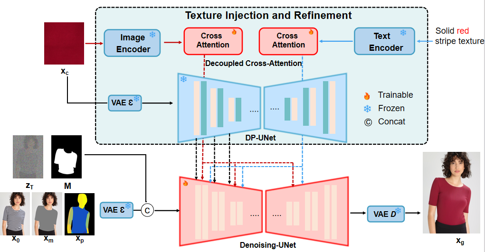
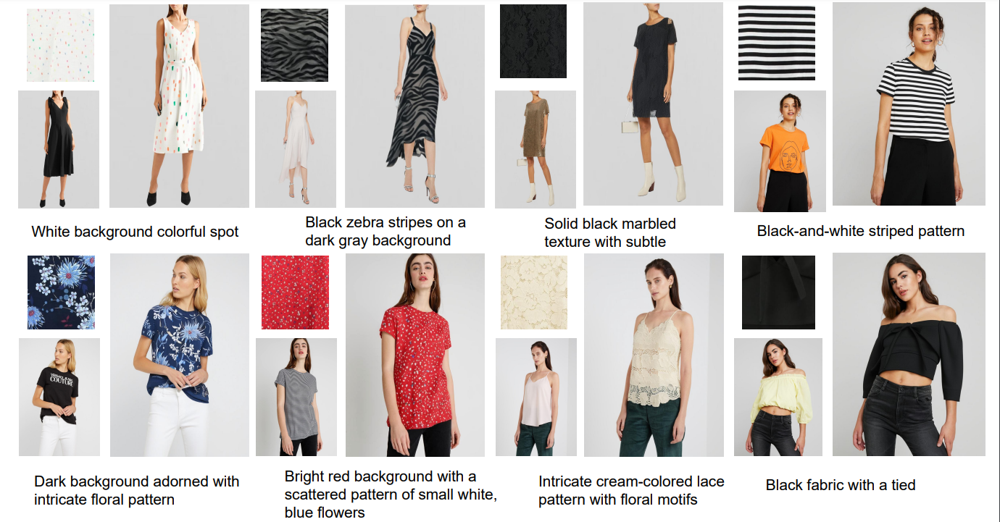

# 🎉 DPDEdit: Detail-Preserved Diffusion Models for Multimodal Fashion Image Editing
This is the official implementation of the paper "DPDEdit: Detail-Preserved Diffusion Models for Multimodal Fashion Image Editing".

## 📌 Project Overview



---

## 📷 Results



---


## ⚙️ Requirements

```
git clone https://github.com/XL-Wang1117/DPDEdit.git
cd DPDEdit

conda env create -f environment.yaml
conda activate dpdedit
```

## 📦 Dataset
```
We evaluate and train DPDEdit on the DPDEdit-Extension dataset — an extension of VITON-HD with annotated texture-image pairs and garment descriptions.

You can download the dataset from:
👉 [🔗 Coming soon]

Expected folder structure:

DPDEdit-Extension/
├── train/
│   ├── image/
│   ├── image-densepose/
│   ├── agnostic-mask/
│   ├── cloth/
│   └── vitonhd_train_tagged.json
├── test/
│   ├── image/
│   ├── image-densepose/
│   ├── agnostic-mask/
│   ├── cloth/
│   └── vitonhd_test_tagged.json
```
🔮 Inference
```
Run inference on the test set:

accelerate launch Inference.py \
    --width 768 \
    --height 1024 \
    --num_inference_steps 30 \
    --output_dir "results" \
    --unpaired \
    --data_dir "PATH_TO_DPDEdit-Extension/test" \
    --seed 42 \
    --test_batch_size 2 \
    --guidance_scale 5.0
Replace PATH_TO_DPDEdit-Extension with your local dataset path.
```
## 🏋️ Training (optional)
```
To train the model from scratch or fine-tune:


accelerate launch train.py \
    --output_dir "checkpoints" \
    --train_batch_size 6 \
    --data_dir "PATH_TO_DPDEdit-Extension/train"
You can modify training configs via parser_args.py or configs/.
```


  title={DPDEdit: Detail-Preserved Diffusion Models for Multimodal Fashion Image Editing},
  author={Xiaolong Wang, Zhigi Cheng, Jue Wang, Huizi Xue, Xiaojiang Peng},
  booktitle={IEEE International Conference on Multimedia and Expo (ICME)},
  year={2025}
}
